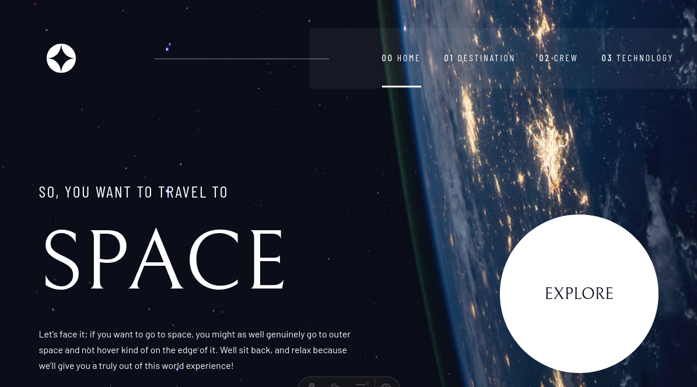

# Frontend Mentor - Space tourism website solution

This is a solution to the [Space tourism website challenge on Frontend Mentor](https://www.frontendmentor.io/challenges/space-tourism-multipage-website-gRWj1URZ3). Frontend Mentor challenges help you improve your coding skills by building realistic projects. 

## Table of contents

- [Overview](#overview)
  - [The challenge](#the-challenge)
  - [Screenshot](#screenshot)
  - [Links](#links)
- [My process](#my-process)
  - [Built with](#built-with)
  - [What I learned](#what-i-learned)
  - [Continued development](#continued-development)
  - [Useful resources](#useful-resources)
- [Author](#author)
- [Acknowledgments](#acknowledgments)

## Overview

### The challenge

Users should be able to:

- View the optimal layout for each of the website's pages depending on their device's screen size
- See hover states for all interactive elements on the page
- View each page and be able to toggle between the tabs to see new information

### Screenshot




### Links

- Solution URL: [Add solution URL here](https://your-solution-url.com)
- Live Site URL: [Add live site URL here](https://space-project-teal-delta.vercel.app/)

## My process

### Built with

- Semantic HTML5 markup
- CSS custom properties
- Flexbox
- CSS Grid
- Mobile-first workflow
- [Astro](https://astro.build/) - Web Framework

### What I learned

This project was built using **Astro**, taking advantage of its island architecture and scoped styling.

One of the key features used is `define:vars` in Astro style blocks to pass dynamic values (like background images) to CSS:

```astro
<style
  define:vars={{
    bgUrl: `url(${backgroundMovil.src})`,
    bgUrl2: `url(${backgroundDesktop.src})`,
  }}
>
  .container-bg {
    background-image: var(--bgUrl);
  }
</style>
```

I also managed responsive designs using media queries to switch between mobile and desktop navigation components:

```css
@media (max-width: 768px) {
  .nav-mobile {
    display: block;
  }
  .nav-desktop {
    display: none;
  }
}
```

### Continued development

In future updates, I plan to:
- Optimize image loading further using Astro's Image component features.
- Refactor repeated styles into reusable utility classes or components.
- Enhance accessibility features.

### Useful resources

- [Astro Documentation](https://docs.astro.build) - The official documentation was essential for understanding the file structure and component syntax.
- [MDN Web Docs](https://developer.mozilla.org/en-US/) - Always helpful for CSS grid and flexbox reference.

## Author

- Website - [Cagd](https://portfolio-cagd.vercel.app/)
- Frontend Mentor - [Cagd](https://www.frontendmentor.io/profile/bhzeuscagd)

## Acknowledgments

Thanks to Frontend Mentor for providing this challenge.
